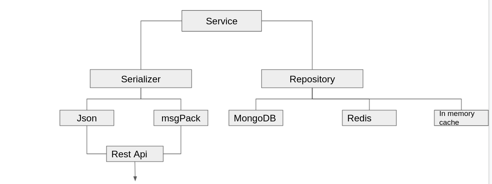

# URL Shortner  Micro Service

Helps you to build simple shortend version of URL that will accept a URL as an argument over a REST API and return a shortened URL as a result.

### ***Prerequisite***

* [Go](https://golang.org/)

* Clone this repository into [GOPATH](https://github.com/golang/go/wiki/GOPATH).

## Design flow digaram



Design flow is simple we would focus on service(Bussiness logic) without having to worry about how it's used.

`eg:   (input) https://www.google.com -> 98sj1-293 (output)
 http://localhost:8000/98sj1-293 -> https://www.google.com`

## Model for Redirect service

```
type Redirect struct {
	Code      string  // to fetch url
	URL       string // URL it self
	CreatedAt int64  // created timestamp (metadata)
}
```

Here I am using 2 serailizers (json,msgPack) so user choice to choose his content-type for communicating b/w apis

And users choice to choose repo here it supports 2 (mongoDB/redis)

### Annotations to model
```
type Redirect struct {
	Code      string `json:"code" bson:"code" msgpack:"code"`
	URL       string `json:"url" bson:"url" msgpack:"url" validate:"empty=false & format=url`
	CreatedAt int64  `json:"created_at" bson:"created_at" msgpack:"created_at"`
}

```
We are using validator annotation in addition so to validate `URL` shouldn't be empty and follow particular format

## Shortner service
Here I am defining few interfaces which I will be implementing going forward
#### Service
```
type RedirectService interface {
	Find(code string) (*Redirect, error)
	Store(redirect *Redirect) error
}
```

* `Find` method takes produced code and gives appropriate redirect url
* `Store` method takes in riderct model and generates shortend code!


#### Serializer
```
type RedirectSerializer interface {
	Decode(input []byte) (*Redirect, error)
	Encode(input *Redirect) ([]byte, error)
}
```

* `Decode` method takes in raw bytes and returns redirect struct/object
* `Encode` mehtod takes in struct and retruns bytes

#### Repository

```
type RedirectRepository interface {
	Find(code string) (*Redirect, error)
	Store(redirect *Redirect) error
}
```

## Design Flow

it's pretty simple now service is connected to repository interface (implementation I would leave it to users choice)
Now we have build api business logic layer central part now we need to link our service to universal serilazer to could connect with transport http 

repo <--- service ---> serializer  ---> http


### Implementing serializer service

now we support two serializers 

* json
* msgPack(Compact version json light weight and faster)

### Implementing Repository 
* For MongoDB
* Redis
* In memory cache (Local)

### Implementing API's to connect to service, swagger docs

providing make files to get swagger.yaml generated automatically

* Implemented http.handlers for GET, POST verbs

`GET` method to redirect to actual url from shorter url
`POST` will generate shorter url

## Redirect Application
* Ability to choose different repos with environment varaibles `DB`
* As of now it supports 2 databases and 1 in memory cache system(by default)
* Now it's easy to setup service with repo of user choice and as we defined intefaces all database implementations serves same purpose.
* using chi multiplexer to route traffic to different handlers based on resource URI

## How to use?

***Build and Run locally***

```
make run
```

***Now perform post request with required url it generates shorten url***

```
1. Post request with content-type as `application/x-msgpack`
msgpack=`echo -e "\x81\xa3url\xa3https://github.com/openshift-pipelines/release-tests/pull/50"` 

curl -X POST -H "Content-Type: application/x-msgpack" --data "$msgpack"  http://localhost:8000/ --output temp.txt

2. Post request with content-type as `application/json`

curl -X POST -H "Content-Type: application/x-msgpack" --data '{"url": "https://github.com/openshift-pipelines/release-tests/pull/50"}'  http://localhost:8000/ 


--------------------------------------------------------------

Response:
{
    "code": "G0S84L77g",
    "url": "https://github.com/openshift-pipelines/release-tests/pull/50",
    "created_at": 1629485529
}
```


## Build and run with dockerfile

```
docker build -t url-shortner .

docker run -it --name url url-shortner:latest

>> listening on port: 8080

now we need  docker ip of running container 

Run below command to get docker ip of running container

docker inspect -f '{{range.NetworkSettings.Networks}}{{.IPAddress}}{{end}}' url

```